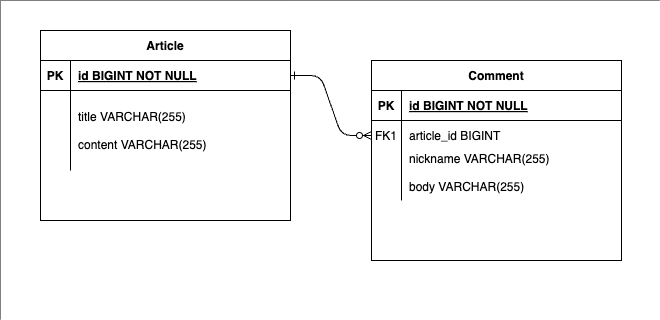
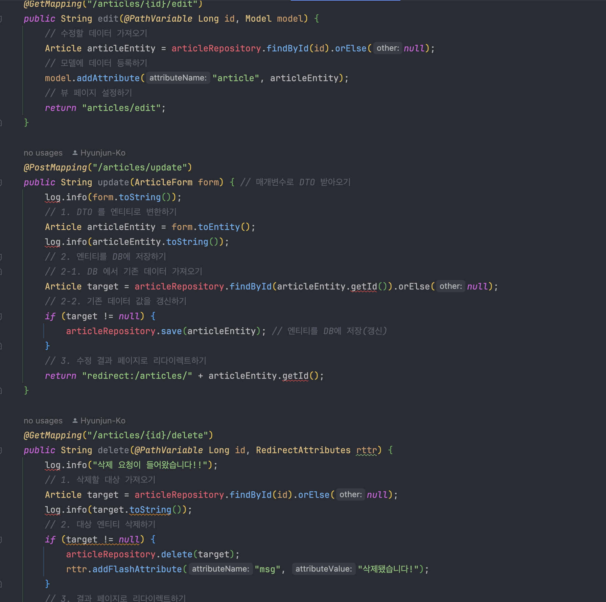

# java-bulletin-board

> Bulletin board for sharing ideas

 

## 1. Development Timeline & Team Members

- 03/01/2024 ~ 03/30/2024
- personal project

 

## 2. Technologies Used

#### `Back-end`

- Java 17
- Spring Boot 3.1.0
- Gradle
- Spring Data JPA
- H2

#### `Front-end`

- thymeleaf
- mustache
- bootstrap v5.0.2

 

## 3. ERD Design (Entity-Relationship Diagram)

## 4. Core Features

Users can freely write new articles and add comments to articles with nicknames of their choice anonymously.

On the main page, articles are displayed with its unique id, title and content of the article.

When users click **New Article**, they can add new articles to the bulletin board.

And, articles can be edited and deleted as well as the comments on them when they are clicked on the main page.

 

<b>Expand Core Feature Description</b>
 

### 4.1. Overall Flow

UML diagram

### 4.2. User Request

Users can make couple of requests such as CRUDs of comments and articles.

### 4.3. Controller

ArticleController

ArticleController utillizes ArticleService and CommentService to serve user requests at designated endpoints.

### 4.4. Service

ArticleService

CommentService

services provide crud operations of entities via repositories.

### 4.5. Repository

ArticleRepository

CommentRepository

 

## 5. Key Troubleshooting Issues

 

## 6. Additional Troubleshooting Issues

 

## 7. Reflection / Insights
